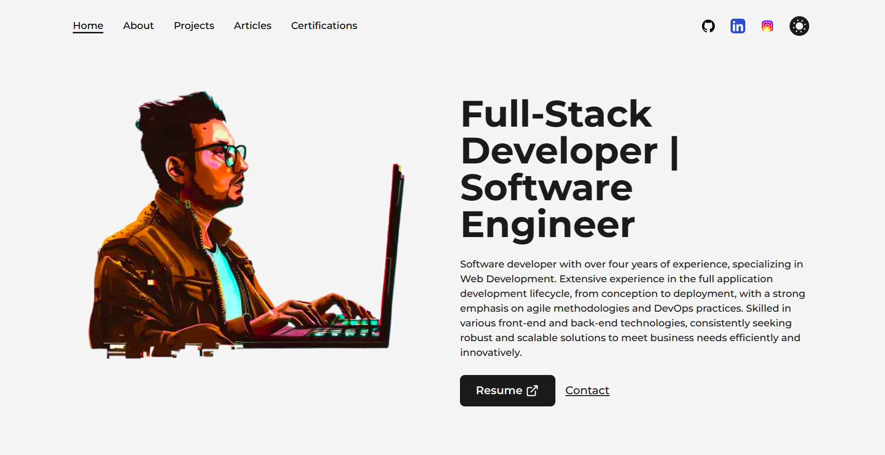

# Portfólio - Sávio Lopes

Este é um projeto [Next.js](https://nextjs.org/) iniciado com [`create-next-app`](https://github.com/vercel/next.js/tree/canary/packages/create-next-app).

Acesse o portfólio em produção [aqui](https://www.saviolopes.com.br/).

## Início Rápido

Para iniciar o servidor de desenvolvimento, execute:

```bash
npm run dev
# ou
yarn dev
# ou
pnpm dev
```

Abra [http://localhost:3000](http://localhost:3000) no seu navegador para ver o resultado.

## Scripts Disponíveis

No diretório do projeto, você pode executar:

### `npm run dev`

Inicia o servidor de desenvolvimento.

### `npm run build`

Constrói a aplicação para produção na pasta `build`.

### `npm start`

Inicia o servidor com a versão de produção criada.

## Tecnologias Utilizadas

- [Next.js](https://nextjs.org/): Framework React para renderização do lado do servidor.
- [React](https://reactjs.org/): Biblioteca JavaScript para criação de interfaces de usuário.
- [Node.js](https://nodejs.org/): Ambiente de execução JavaScript.

## Autor

Desenvolvido por [Sávio Lopes](https://www.saviolopes.com.br/). Entre em contato por [email](mailto:lopessaviodev@gmail.com).
